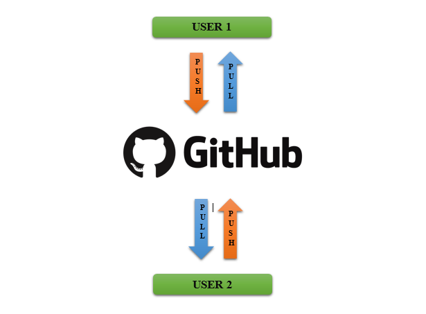

<h2 align="center">Apa Itu Github?</h2>
 
<strong>Latar belakang masalah:</strong>
1.Apa itu Github?
2.Apa itu SSH ?
3.Apa itu organization dalam github?
4.Bagaimana cara mengupload file ke github?
 

<strong>Isi:</strong>Isi:
Baiklah kali ini saya akan menjelaskan tentang github,baik itu dalam membuat ssh key,upload file ke repository,membuat organization.
Github adalah software hosting untuk sebuah proyek open source yang mengguanakn tool system revisi kontrol git ,apa maksudnya? Maksudnya adalah tool untuk mengedit code yang telah kita upload.Jadi di Github kita bisa mengupload kodingan yang telah kita buat,dan kita juga bisa melakukan editing kodingan kita yang telah diupload di github.Github bisa juga kita anggap sebagai jejaring sosialnya software developer.
 

  

 
SSH adalah autentifikasi akun github kita ke PC yang sedang kita gunakan,jadi ketika kita melakukan upload file ke repository,kita tidak perlu lagi memasukkan username dan password.
 
Langkah-langkah menambah ssh key:
&nsbp;&nsbp;&nsbp;&nsbp;1.login terlebih dahulu ke akun github
&nsbp;&nsbp;&nsbp;&nsbp;2.kemudian klik pada gambar profil sebelah kanan atas,pilih setting
&nsbp;&nsbp;&nsbp;&nsbp;3.pada setting pilih menu ssh 
&nsbp;&nsbp;&nsbp;&nsbp;4.kemudian klik new
&nsbp;&nsbp;&nsbp;&nsbp;5.masukkan title
&nsbp;&nsbp;&nsbp;&nsbp;6.kemudian pada git bash,ketikkan perintah seperti berikut
&nsbp;&nsbp;&nsbp;&nsbp;7.ssh-keygen -t rsa -b 4096 -C "email github anda"
&nsbp;&nsbp;&nsbp;&nsbp;8.lalu enter,kemudian ketikkan perintah
&nsbp;&nsbp;&nsbp;&nsbp;9.cat ~/.ssh/id_rsa.pub
&nsbp;&nsbp;&nsbp;&nsbp;10.lalu enter,kemudia copy code yang muncul
&nsbp;&nsbp;&nsbp;&nsbp;11.lalu paste ke kolom key yang ada saat pembuatan ssh key tadi(di web github)
&nsbp;&nsbp;&nsbp;&nsbp;12.kemudian klik add ssh key

 

Organization dalam github itu adalah sebuah organisasi dalam github yang membuat kita bisa berkolaborasi dengan user lain dalam github,yang tentunya user yang dapat berkolaborasi itu harus ada pada organization yang sama dengan kita.
 
Langkah-langkah upload file ke github:
&nsbp;&nsbp;&nsbp;&nsbp;1.Buat sebuah repostitory
&nsbp;&nsbp;&nsbp;&nsbp;2.Pada folder yang ingin di upload klik kanan lalu pilih git bash here
&nsbp;&nsbp;&nsbp;&nsbp;3.Kemudia pada git bash ketikkan perintah berikut:
&nsbp;&nsbp;&nsbp;&nsbp;4.git init
&nsbp;&nsbp;&nsbp;&nsbp;5.git remote add origin link repository
&nsbp;&nsbp;&nsbp;&nsbp;6.git pull origin master
&nsbp;&nsbp;&nsbp;&nsbp;7.git status
&nsbp;&nsbp;&nsbp;&nsbp;8.git add folder/file
&nsbp;&nsbp;&nsbp;&nsbp;9.git status
&nsbp;&nsbp;&nsbp;&nsbp;10.git add folder/file (perintah ini digunakan apabila file kita berada pada suatu foder)
&nsbp;&nsbp;&nsbp;&nsbp;11.git status (jika muncul:On branch master Changes to be committed) langsung ke
&nsbp;&nsbp;&nsbp;&nsbp;12.git commit -m "komen"
&nsbp;&nsbp;&nsbp;&nsbp;13.git status (jika muncul:nothing to commit, working tree clean) langsung ke
&nsbp;&nsbp;&nsbp;&nsbp;14.git push origin master

 

<strong>Kesimpulan:</strong>
Github itu adalah tempat mengupload file project kita,didalam github kita bisa mengedit file yang telah kita upload.Didalam github juga memungkinkan kita berkolaborasi dengan membuat organization.
 
<strong>Saran:</strong>
Setidaknya bagi seorang developer harus menggunakan github dalam pengembangan aplikasinya,selain bermanfaat bagi orang lain juga bermanfaat bagi developer itu sendiri.

<strong>Referensi:</strong>
http://www.github.com
http://www.candra.web.id/pengenalan-github-untuk-pemula/

<strong>Plagiarisme:</strong>Plagiarisme:
https://drive.google.com/open?id=0B3nknNj1iYgDaW1HRE1jakV0VG8
https://drive.google.com/open?id=0B3nknNj1iYgDUXNoVUtTQWc3b3c